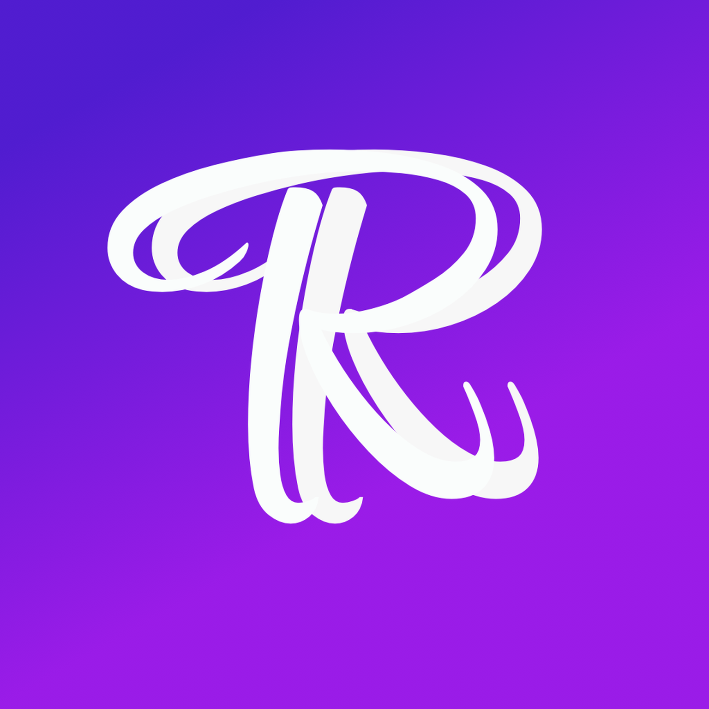
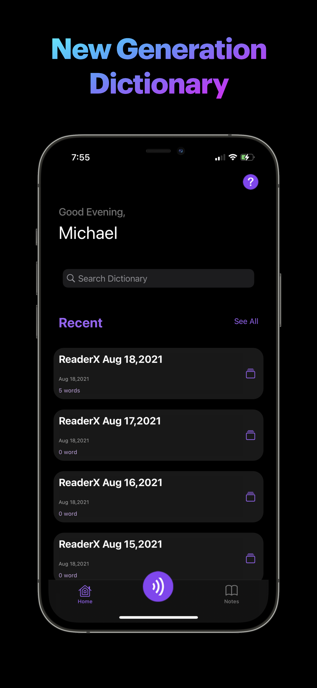
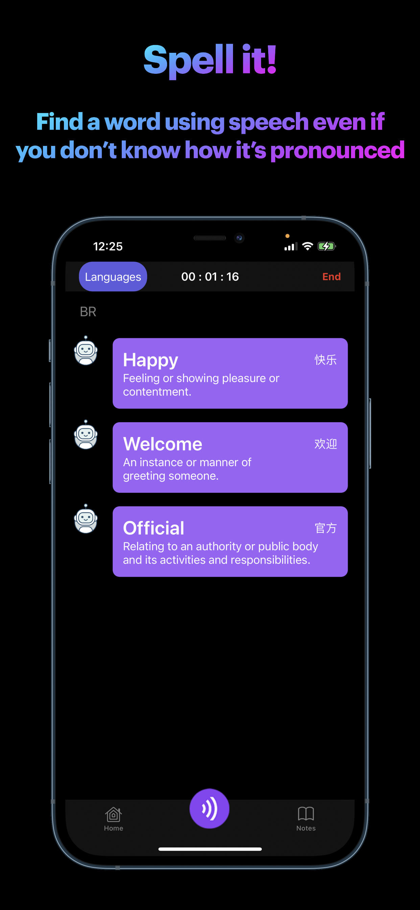
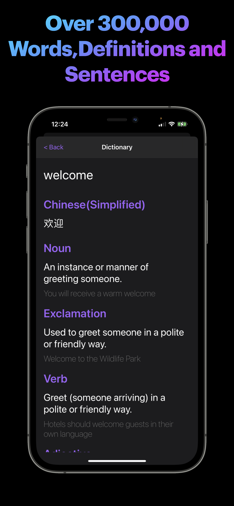
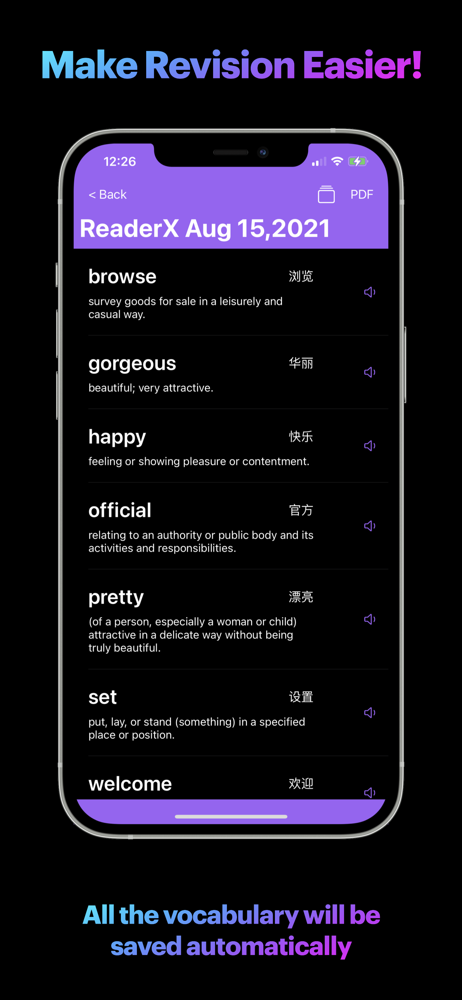
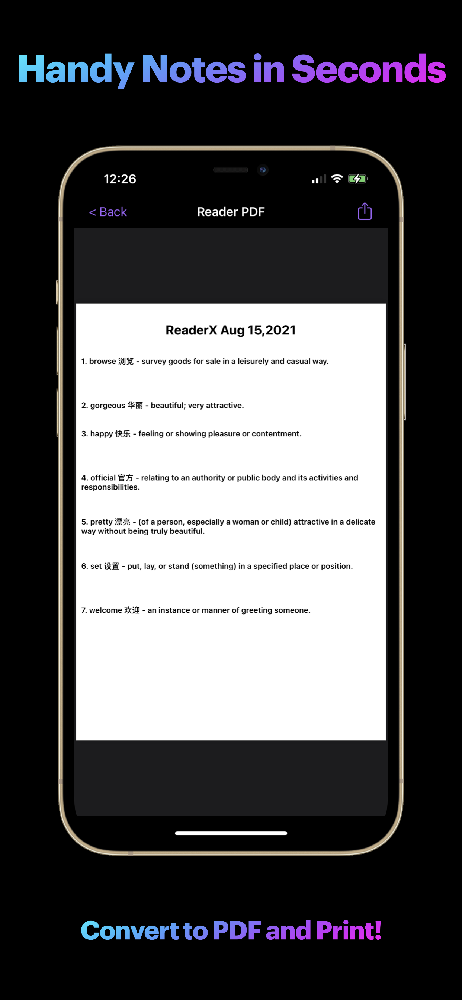
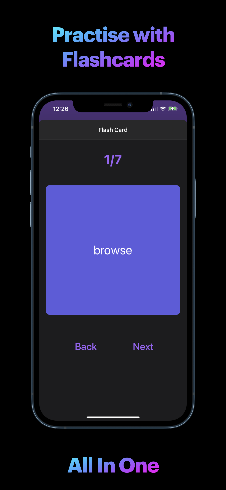

# 📖 ReaderX

ReaderX is a revolutionary dictionary and translation app built with Swift for iOS.  
Its main goal is to help readers instantly understand unfamiliar words, making reading more enjoyable, efficient, and seamless.  
Think of ReaderX as your **personal reading companion** that’s always ready to help you master new vocabulary.

---

## ✨ Features

- **Extensive Dictionary**: Access over **300,000 words**, definitions, and practical example sentences.
- **Perfect English Pronunciation**: Listen, learn, and practice native-like pronunciation.
- **Flashcards for Learning**: Reinforce memory through spaced repetition — because practice makes perfect!
- **Automatic Word Saving**: Every word you search is saved, making revision effortless.
- **Voice Control**: Search for words hands-free with built-in speech recognition.
- **PDF Notes Generator**: Export your saved words and notes into a polished PDF in seconds.
- **Beautiful UI**: A sleek, user-friendly interface designed to enhance your reading experience.

---

## 🏆 Achievements

- Ranked **Top 200** in the iOS App Store (Reference category)  
- Peaked at **#115** 🎉

---

## 🛠️ Tech Stack

- **Language**: Swift  
- **Frameworks**: SwiftUI  
- **APIs**: Speech Recognition, Microsoft Azure  
- **Platform**: iOS  

---

### Requirements
- iOS 15.0+  
- Xcode 14+  
- Swift 5.7+
- 
## Screenshots

  
  
  
  
  
  

